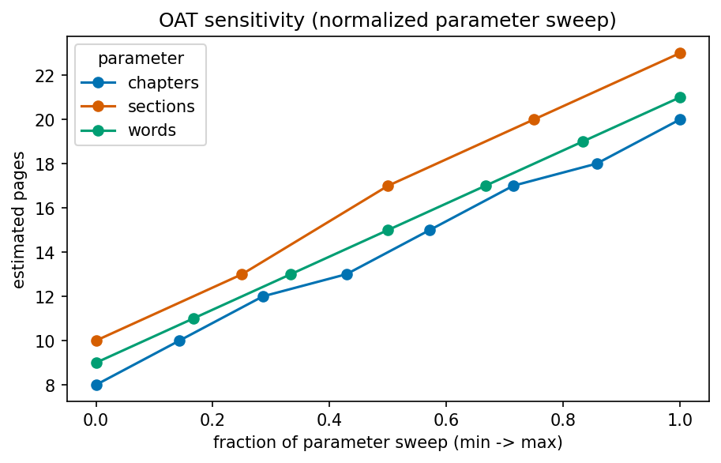
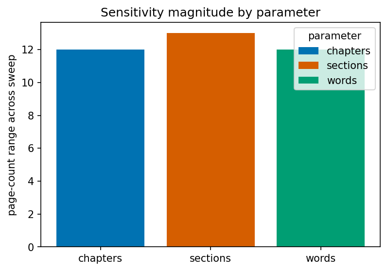
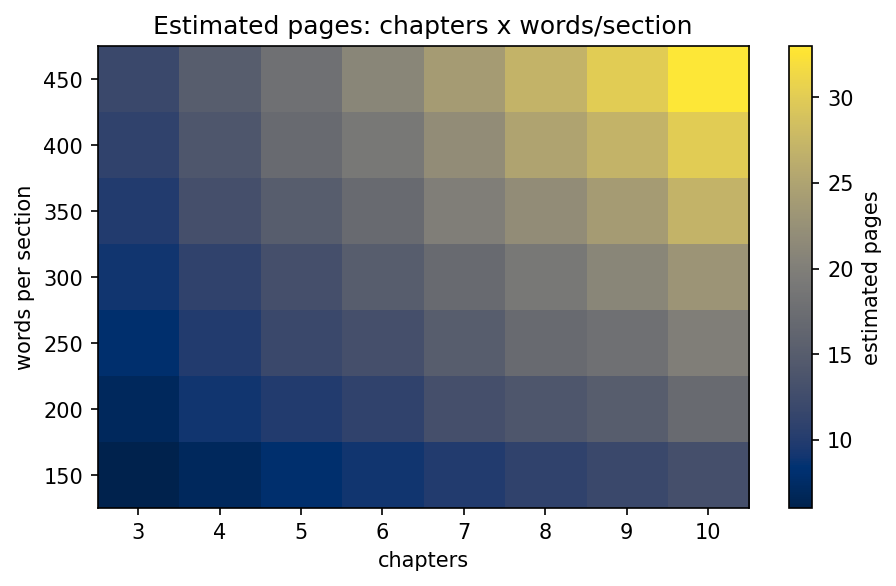
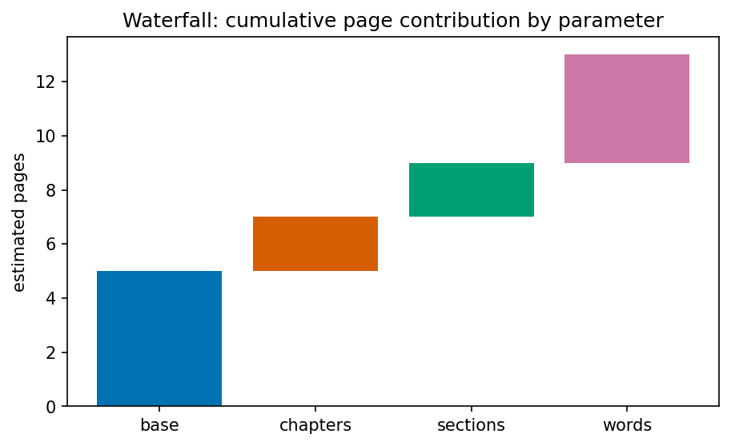
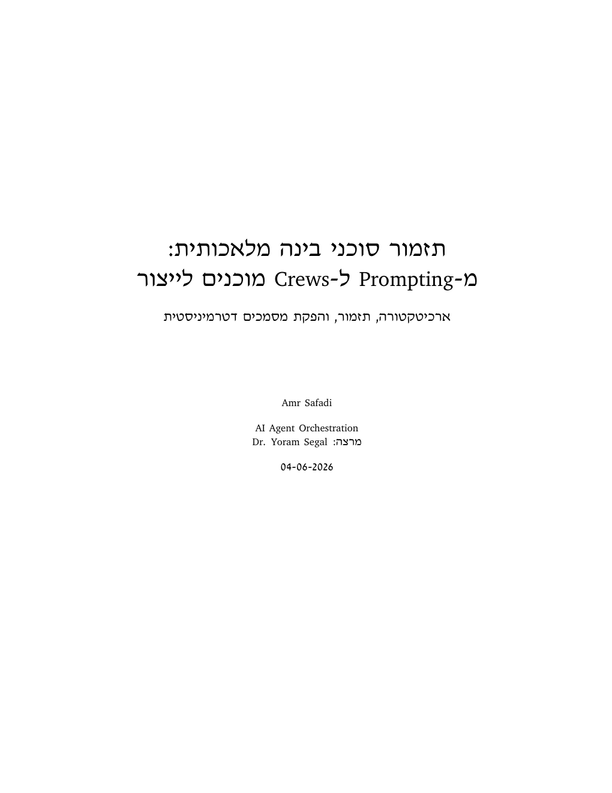
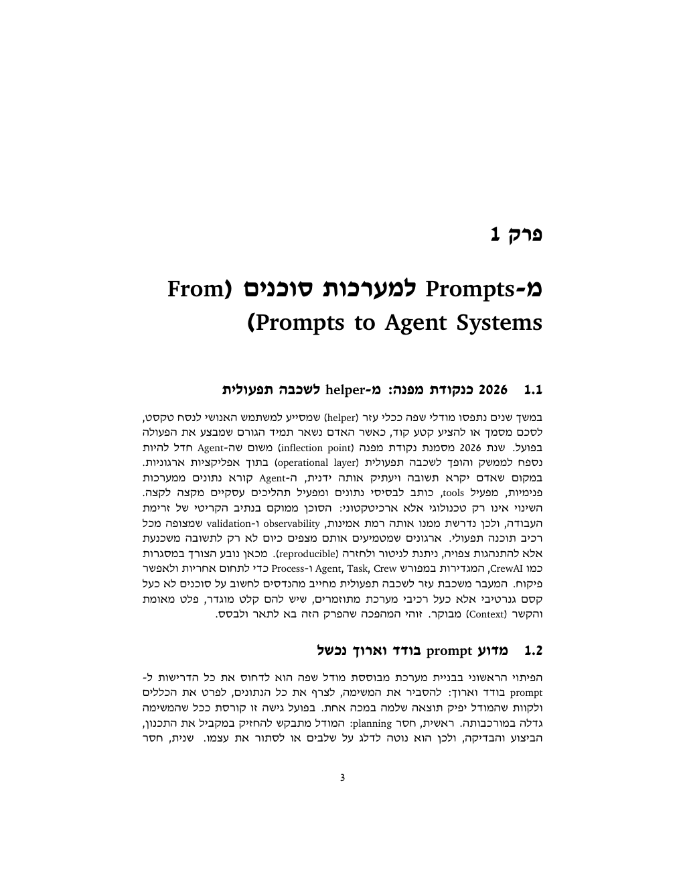
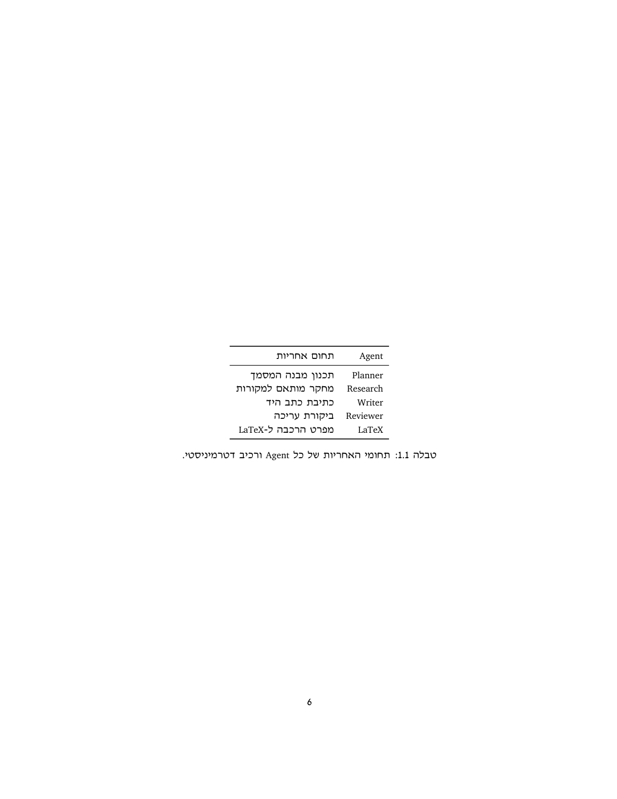
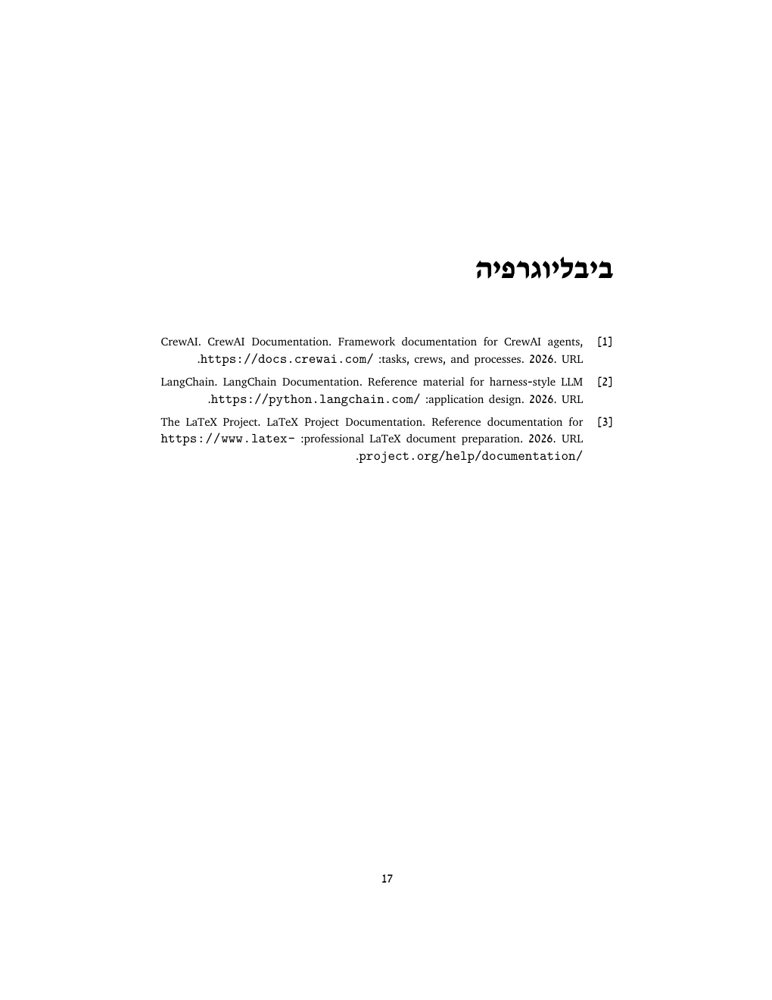

# AI Agent Orchestration HW3

CrewAI-based article/book generator with a deterministic LaTeX PDF production harness.

A small sequential CrewAI crew (Planner → Research → Writer → Reviewer → LaTeX)
produces structured content, and deterministic Python components turn it into a
professional LaTeX PDF. Built for the AI Agent Orchestration course.

## Purpose

Instead of asking one model to "write a book and make a PDF", the system
separates reasoning-heavy work (planning, research, writing, review) from fragile
deterministic work (citations, graph generation, validation, LaTeX rendering, PDF
compilation). Requirements: [docs/PRD.md](docs/PRD.md); architecture:
[docs/PLAN.md](docs/PLAN.md).

## Status

Implemented: planning docs, config + Pydantic schemas, deterministic harness
(citations/BibTeX, matplotlib graph, validators), and the five-agent crew with a
safe dry-run default. Also implemented: LaTeX rendering, PDF compilation, the
SDK facade, API gatekeeper/rate limits, CrewAI Skills, and a committed final
PDF snapshot at `final.pdf`. Real paid CrewAI execution is available only as an
opt-in path and is not required for grading. Live status:
[docs/IMPLEMENTATION_STATUS.md](docs/IMPLEMENTATION_STATUS.md).

## Report

A running summary of what we have built. The project is in submission-ready
mode: the deterministic dry-run and PDF deliverable are complete, and the real
paid CrewAI path is implemented as an optional, API-key guarded workflow.

**Delivered so far (verified working)**
- **Documentation:** `PRD`, `PLAN` (architecture, ADRs, extensibility, components),
  `TODO` (604 granular tasks), `PROMPTS` (prompt log), per-mechanism PRDs
  (`PRD_latex_pipeline`, `PRD_citation_management`), `COSTS`, `USAGE`, plus the
  blueprint/status/quick-start.
- **Foundation (Phase A):** versioned config — every `config/*.json` carries a
  `version` — with Pydantic loaders, logging, and a single-source `shared/version.py`.
- **Schemas (Phase B):** 10 artifact contracts (`schemas.py` + `report_schemas.py`)
  with validators, documented examples, and round-trip tests.
- **Deterministic harness:** citation/BibTeX manager, matplotlib pipeline graph,
  document validators.
- **CrewAI orchestration:** five agents, five context-linked tasks, a sequential
  crew with a safe **dry-run default** (no API, no cost).
- **CrewAI Skills:** three knowledge packs under `skills/` (latex-style,
  citation-discipline, course-alignment) with a discovery/assignment loader wired
  into the agents in real-crew mode — the course Skill concept.
- **LaTeX PDF pipeline:** Jinja2 templates, LaTeX escaping, LuaLaTeX/biber
  compiler integration, generated bibliography, and a verified 19-page
  Hebrew-primary PDF on football analytics.
- **Quality tooling:** Ruff lint (0 violations) + `ruff format`; a shared pre-commit
  hook; GitHub Actions CI enforcing an 85% coverage gate.
- **Build skill:** a Claude Code `/build-bookgen` skill that encodes our build workflow.
- **Tests:** 139 passed, 2 skipped, **94.05%** coverage.

**Verified**
- `ruff check` → 0 violations; `ruff format` → clean; every code file ≤ 150 lines.
- `pytest tests --cov=bookgen` -> 139 passed, 2 skipped; coverage 94.05% (gate 85%).
- The dry-run pipeline produces all five intermediate artifacts, assets, and
  `generated/latex/main.tex` with no API call.
- `--dry-run --build-pdf` compiles the final PDF when a TeX toolchain is
  installed; a verified snapshot is committed at `final.pdf`.

**Submission notes**
- Push the final branch so GitHub has the latest real-run hardening and
  documentation evidence.
- Reproducing the PDF from scratch requires a local TeX toolchain; grading can
  use the committed `final.pdf` snapshot directly.
- Real paid CrewAI execution is optional. When used, raw task outputs,
  validated artifacts, token usage, and budget alerts are written under
  `generated/intermediate/`.

### Analysis & Results

A deterministic **parameter-sensitivity study** (a one-at-a-time sweep, a
finite-difference partial-derivative index, and a lean/baseline/rich comparison)
quantifies how the document's structural parameters drive its estimated compiled
length, modelled as `pages = ceil(chapters * sections * words / 450) + 3`. Full
methodology, equations, and references are in
[`notebooks/sensitivity_analysis.ipynb`](notebooks/sensitivity_analysis.ipynb);
the logic lives in `bookgen.research.sensitivity` and is reachable through
`BookGenSDK().run_sensitivity_analysis()`.

**Key finding:** at the baseline (6 chapters, 3 sections, ~250 words/section),
**sections-per-chapter is the most influential parameter** (∂pages/∂sections =
3.5 pages per unit, sweep range 13 pages), ahead of chapters (1.5 per unit, range
12) and words-per-section (0.5 per unit, range 12). Words-per-section spans the
widest raw value range but has the smallest per-unit effect — so the OAT chart
uses a normalized sweep axis to keep the three parameters visually comparable.

| | |
|:---:|:---:|
|  |  |
| *OAT sweep on a normalized axis — `sections` is the steepest curve.* | *Page-count range per parameter across its sweep (sections largest).* |
|  |  |
| *Estimated pages over chapters × words-per-section.* | *Cumulative page contribution, baseline → full.* |

All six figures (the four above plus a scatter and a box plot) are rendered
concurrently by `BookGenSDK().generate_sensitivity_figures()` using a
colorblind-safe Okabe–Ito palette at 150 DPI.

**Cost analysis (config-driven, guideline 11).** `BookGenSDK.estimate_cost()` —
also exposed on the CLI via `--estimate-cost` — forecasts token usage and USD
from the `config/models.json` pricing block with no API call. A typical ~15-page
run costs **~$0.02** on the default `gpt-4o-mini` (≈$0.35 on `gpt-4o`, ≈$0.50 on
`claude-sonnet-4-6`). Full breakdown: [docs/COSTS.md](docs/COSTS.md).

## Installation

**Requirements**
- Python 3.10+
- [`uv`](https://docs.astral.sh/uv/) (package manager / runner)
- PowerShell (Windows) or any POSIX shell
- Optional, only to compile the final PDF: a LaTeX toolchain (MiKTeX or TeX Live
  with `lualatex` + `biber`)

**Fresh-machine setup**
```powershell
git clone https://github.com/AmrSafadi/AI-Agent-Orchestration-HW3.git
cd <path-to>\AI-Agent-Orchestration-HW3
uv sync                 # optional: resolve/install into a local env
copy .env-example .env  # only needed for real (paid) runs
```
No secrets are required for the default dry-run path.

**Troubleshooting**
- `ModuleNotFoundError: bookgen` → ensure `PYTHONPATH=src` (the commands below set it).
- `OPENAI_API_KEY is required` → you passed `--run-crew`; set the key or use the default dry-run.
- PDF step errors → install a LaTeX toolchain (see Requirements).

## Usage

Set `$env:PYTHONPATH="src"` first. Full interface details: [docs/USAGE.md](docs/USAGE.md).

```powershell
# Safe startup check (default, no API):
uv run --no-project --with pydantic --with matplotlib --with jinja2 python -m bookgen.main

# Explicit dry-run:
uv run --no-project --with pydantic --with matplotlib --with jinja2 python -m bookgen.main --dry-run

# Render and compile the PDF (requires lualatex + biber):
uv run --no-project --with pydantic --with matplotlib --with jinja2 python -m bookgen.main --dry-run --build-pdf

# Cost forecast for a real run (config-driven, no API call):
uv run --no-project --with pydantic --with matplotlib --with jinja2 python -m bookgen.main --estimate-cost

# Real crew run (needs OPENAI_API_KEY, costs money):
uv run python -m bookgen.main --run-crew
```

**Example (dry-run output)**
```text
BookGen configuration loaded successfully.
Project title: AI Agent Orchestration HW3
Topic: Football Analytics and AI-Based Match Strategy
Output directory: ...\generated
Execution mode: DRY-RUN (default).
Crew assembled: 5 agents, 5 tasks, process=sequential.
Dry-run completed. CrewAI kickoff was not called.
Rendered LaTeX project: ...\generated\latex\main.tex
Rendered main.tex (LaTeX compilation not requested).
```

The committed `final.pdf` at the repository root is the deliverable; running
`--dry-run` regenerates `generated/latex/main.tex`, and `--dry-run --build-pdf`
recompiles the PDF (and refreshes the committed `final.pdf` snapshot) when a TeX
toolchain is present.

**Compiled deliverable (Hebrew-primary, 19 pages) — sample pages:**

| Cover | Chapter | Table | Bibliography |
|:---:|:---:|:---:|:---:|
|  |  |  |  |

The full snapshot is committed at [`final.pdf`](final.pdf); all rendered-page
screenshots live in `assets/screenshots/`.

## Configuration Guide

Versioned JSON under `config/` (no hardcoded values in code):

| File | Purpose |
|---|---|
| `config/setup.json` | Project metadata (name, topic, author, course) and workflow (process, agents, paths). |
| `config/models.json` | Provider and model defaults. |
| `config/latex.json` | LaTeX engine (`lualatex`), fallback, bib backend (`biber`), passes, BiDi flag. |
| `config/budgets.json` | Budget / cost caps. |

Secrets live only in `.env` (never committed); `.env-example` documents the
variables. Cost details: [docs/COSTS.md](docs/COSTS.md).

## Quality Tooling

| Task | Command |
|---|---|
| Lint | `uv run --no-project --with ruff ruff check .` |
| Format | `uv run --no-project --with ruff ruff format .` |
| Tests | `$env:PYTHONPATH="src"; uv run --no-project --with pydantic --with pytest --with pytest-cov --with matplotlib --with jinja2 python -m pytest tests --cov=bookgen` |
| Coverage | enforced at 85% via `pyproject.toml` and CI |

Install the shared pre-commit hook once (runs lint + format check before each commit):
```powershell
git config core.hooksPath scripts/hooks
```
CI (`.github/workflows/ci.yml`) runs ruff, the format check, and `pytest --cov`
(85% gate) on every pull request.

## Documentation

| Need | Document |
|---|---|
| Requirements | [docs/PRD.md](docs/PRD.md) |
| Architecture & decisions | [docs/PLAN.md](docs/PLAN.md) |
| Task backlog | [docs/TODO.md](docs/TODO.md) |
| Prompt log | [docs/PROMPTS.md](docs/PROMPTS.md) |
| Costs | [docs/COSTS.md](docs/COSTS.md) |
| Usage / UI | [docs/USAGE.md](docs/USAGE.md) |
| Full vision | [docs/PROJECT_BLUEPRINT.md](docs/PROJECT_BLUEPRINT.md) |
| Setup & commands | [docs/QUICK_START.md](docs/QUICK_START.md) |

## Contributing

See [docs/CONTRIBUTING.md](docs/CONTRIBUTING.md). In short: keep the dry-run
default, don't add agents beyond the approved five, keep deterministic components
deterministic, and update `docs/IMPLEMENTATION_STATUS.md` after each milestone.
Use feature branches and pull requests, and install the pre-commit hook above.

Code standards: see [docs/CONTRIBUTING.md](docs/CONTRIBUTING.md) (ruff 0
violations, `ruff format`, ≤ 150 lines/file, docstrings, 85% coverage).

## License & Credits

This project is released under the **MIT License** — see [`LICENSE`](LICENSE).
Copyright (c) 2026 Amr Safadi and Sharbel Maroun. Course: AI Agent Orchestration.

### Third-party attribution

Runtime dependencies and their licenses:

| Component | Purpose | License |
| :--- | :--- | :--- |
| [CrewAI](https://docs.crewai.com/) | Agent/Task/Crew orchestration | MIT |
| [Pydantic](https://docs.pydantic.dev/) | Schema validation | MIT |
| [Jinja2](https://jinja.palletsprojects.com/) | LaTeX templating | BSD-3-Clause |
| [Matplotlib](https://matplotlib.org/) | Python-generated graphs | Matplotlib (BSD-style) |
| [python-dotenv](https://github.com/theskumar/python-dotenv) | Local env loading | BSD-3-Clause |

PDF production uses the **LaTeX** toolchain (LuaLaTeX + biber, LPPL) and a Hebrew
font such as **David CLM** from the [Culmus](https://culmus.sourceforge.io/)
project (GPL/OFL). These are required at compile time but are not bundled here.

## Important Boundary

The default path is local and deterministic: it does **not** call any API. It
renders `generated/latex/main.tex`; PDF compilation happens only when
`--build-pdf` is supplied and a TeX toolchain is installed. Real CrewAI execution
requires the explicit `--run-crew` flag and `OPENAI_API_KEY`.
