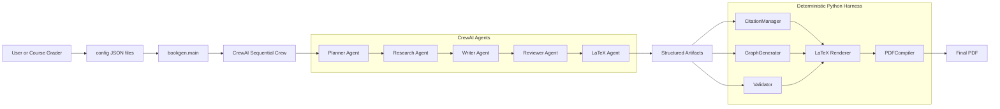
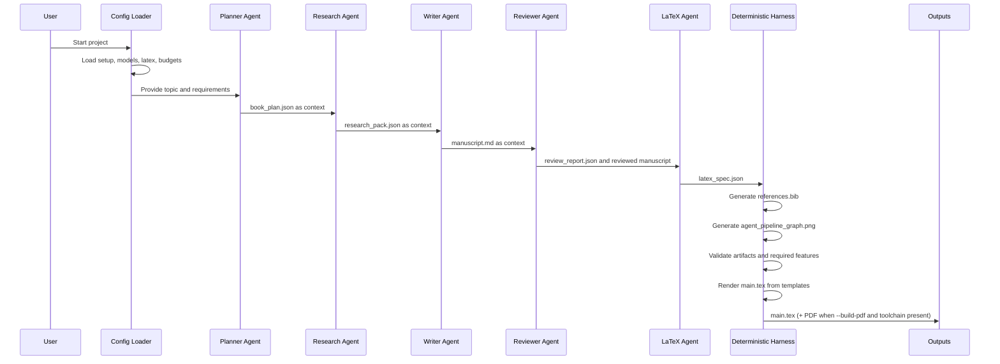

# Architecture Diagram

This document gives visual diagrams and explains every component.

**Status:** 135 tests passing, 1 skipped, 95.22% coverage (gate 85%), ruff clean. Renderer and compiler are implemented and the deliverable PDF compiles end-to-end: `uv run --no-project --with pydantic --with matplotlib --with jinja2 python -m bookgen.main --dry-run --build-pdf` produces a 19-page Hebrew-primary football analytics `final.pdf`, and a snapshot copy is committed at the repository root as `final.pdf`. Reproducing the PDF from scratch requires a free TeX toolchain (lualatex+biber) plus the culmus Hebrew font (David CLM).

**Package layout:** `sdk/` (BookGenSDK facade), `shared/` (config, constants, gatekeeper, logging, version), `orchestration/` (agents, tasks, crew, dry_run, skills), `harness/` (citations, graph_generator, assets, evidence), `document/` (validators, schemas, report_schemas), `latex/` (renderer, compiler, escaping, build).

## Mermaid Architecture Diagram

## Mermaid Workflow Diagram

## Component Explanation

### User Or Course Grader

Runs the project, inspects outputs, and evaluates course alignment.

### Config JSON Files

Located in `config/`. They define project metadata, model defaults, LaTeX settings, paths, and budget placeholders.

### `bookgen.main`

Thin CLI entry point that delegates to the `BookGenSDK` facade (the single entry point holding all business logic). It loads config, prints output directories, and runs dry-run by default. Invocation: `uv run --no-project --with pydantic --with matplotlib --with jinja2 python -m bookgen.main --dry-run [--build-pdf] [--run-crew]`. The `--build-pdf` flag renders `main.tex` and compiles the PDF when the TeX toolchain is present; `--run-crew` enables real CrewAI execution and requires `OPENAI_API_KEY`.

### CrewAI Sequential Crew

Implemented orchestration layer. `build_crew()` assembles the five agents and five tasks using `Process.sequential`, with dry-run safety as the default.

### Planner Agent

Implemented factory in `orchestration/agents.py`, wired into the sequential crew via `tasks.py`/`crew.py`. Creates the book plan and requirement placement checklist.

### Research Agent

Implemented factory in `orchestration/agents.py`, wired into the sequential crew via `tasks.py`/`crew.py`. Creates the research pack and source notes from the plan.

### Writer Agent

Implemented factory in `orchestration/agents.py`, wired into the sequential crew via `tasks.py`/`crew.py`. Writes the manuscript using plan and research context.

### Reviewer Agent

Implemented factory in `orchestration/agents.py`, wired into the sequential crew via `tasks.py`/`crew.py`. Checks clarity, factual consistency, and requirement coverage.

### LaTeX Agent

Implemented factory in `orchestration/agents.py`, wired into the sequential crew via `tasks.py`/`crew.py`. Creates a LaTeX assembly specification. It does not compile PDF.

### Structured Artifacts

The planned file-based handoff between stages. Dry-run writes these under `generated/intermediate/`:

- `book_plan.json`
- `research_pack.json`
- `manuscript.md`
- `review_report.json`
- `latex_spec.json`

### CitationManager

Implemented in `src/bookgen/harness/citations.py`. It loads `data/input/source_registry.json`, writes `data/references/references.bib`, and validates manuscript citation keys.

### GraphGenerator

Implemented in `src/bookgen/harness/graph_generator.py`. It writes `generated/assets/graphs/agent_pipeline_graph.png`.

### Validator

Implemented in `src/bookgen/document/validators.py`. It checks required artifacts and required document features.

### LaTeX Renderer

Implemented in `src/bookgen/latex/renderer.py`. `render_main_tex` renders `.tex` files from Jinja templates using the `\VAR{}`/`\BLOCK{}` delimiter syntax and `escape_latex` for safe text injection.

The rendered document is Hebrew-primary (RTL): the template sets `\setmainlanguage{hebrew}`, `\setotherlanguage{english}`, and `\setmainfont{David CLM}`. The manuscript is roughly 3,260 Hebrew words, with English kept inline only for technical terms (Agent, Task, Crew, Harness, validation). An explicit `\begin{english}` LTR block demonstrates the RTL-to-LTR BiDi transition.

### PDFCompiler

Implemented in `src/bookgen/latex/compiler.py`. `compile_pdf` runs the multi-pass toolchain (`lualatex` -> `biber` -> `lualatex` -> `lualatex`), degrades gracefully via `toolchain_available`, and returns a `CompileResult`.

### Final PDF

The render and compile path is implemented and verified. `final.pdf` is compiled end-to-end (19 pages, Hebrew-primary football analytics) and committed at the repository root as `final.pdf` so a grader sees it on clone; the generated copy lives at `generated/pdf/final.pdf`. Verified with MiKTeX (LuaHBTeX / lualatex + biber) and the culmus "David CLM" font: cover, TOC, embedded image, Python-generated graph, table, mathematical formula, Hebrew-English BiDi (including an explicit `\begin{english}` block), and the bibliography with 3 sources all render; biber resolves the bibliography. Reproducing the PDF from scratch requires a free TeX toolchain (lualatex+biber) plus the culmus Hebrew font (David CLM).
