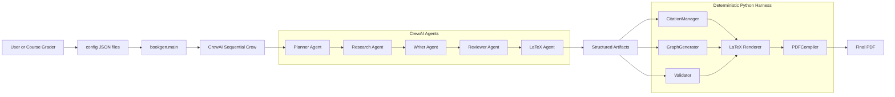
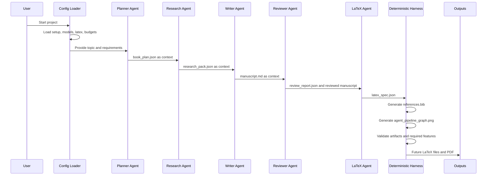

# Architecture Diagram

This document gives visual diagrams and explains every component.

## Mermaid Architecture Diagram

## Mermaid Workflow Diagram

## Component Explanation

### User Or Course Grader

Runs the project, inspects outputs, and evaluates course alignment.

### Config JSON Files

Located in `config/`. They define project metadata, model defaults, LaTeX settings, paths, and budget placeholders.

### `bookgen.main`

Current entry point. It loads config and runs dry-run by default. Real CrewAI execution requires `--run-crew` and `OPENAI_API_KEY`.

### CrewAI Sequential Crew

Implemented orchestration layer. It assembles the five agents and five tasks using `Process.sequential`, with dry-run safety as the default.

### Planner Agent

Implemented factory for the future agent that creates the book plan and requirement placement checklist.

### Research Agent

Implemented factory for the future agent that creates the research pack and source notes from the plan.

### Writer Agent

Implemented factory for the future agent that writes the manuscript using plan and research context.

### Reviewer Agent

Implemented factory for the future agent that checks clarity, factual consistency, and requirement coverage.

### LaTeX Agent

Implemented factory for the future agent that creates a LaTeX assembly specification. It does not compile PDF.

### Structured Artifacts

The planned file-based handoff between stages:

- `book_plan.json`
- `research_pack.json`
- `manuscript.md`
- `review_report.json`
- `latex_spec.json`

### CitationManager

Implemented in `src/bookgen/harness/citations.py`. It loads `data/input/source_registry.json`, writes `data/references/references.bib`, and validates manuscript citation keys.

### GraphGenerator

Implemented in `src/bookgen/harness/graph_generator.py`. It writes `generated/assets/graphs/agent_pipeline_graph.png`.

### Validator

Implemented in `src/bookgen/document/validators.py`. It checks required artifacts and required document features.

### LaTeX Renderer

Placeholder in `src/bookgen/latex/renderer.py`. Future milestone will render `.tex` files from templates.

### PDFCompiler

Placeholder in `src/bookgen/latex/compiler.py`. Future milestone will compile LaTeX to PDF.

### Final PDF

Future final output. It is intentionally not generated yet.
