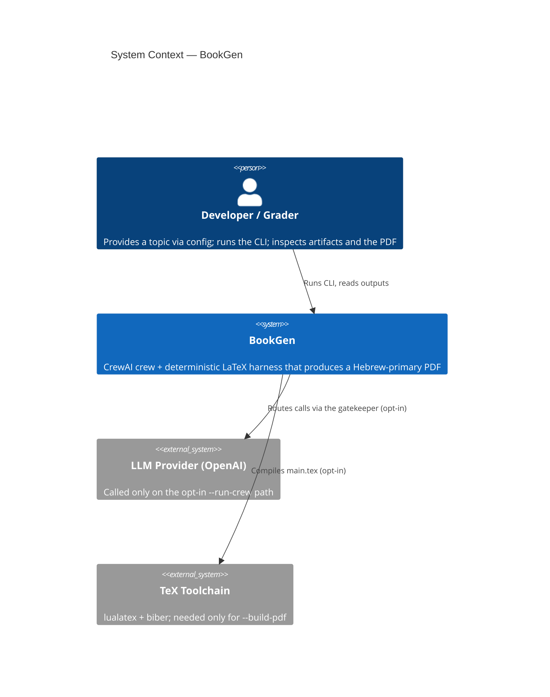
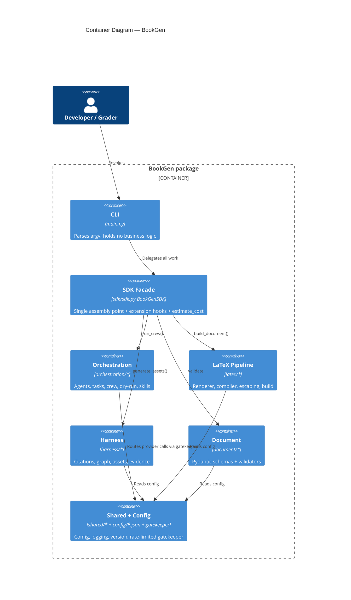
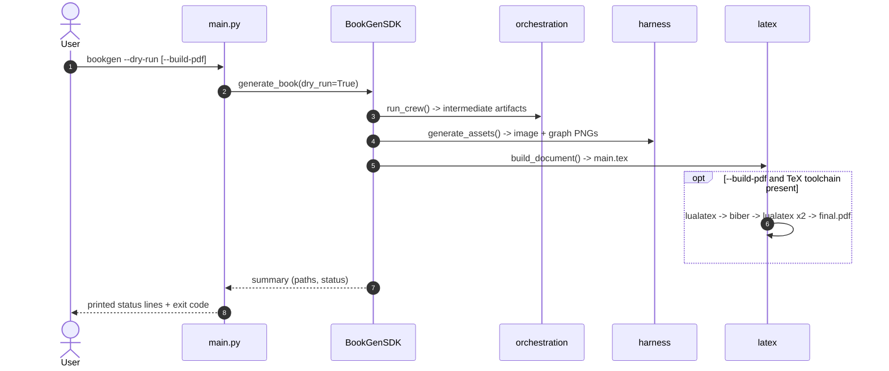

# Design and Architecture Plan (PLAN)

Mandatory document per submission guideline 2.2. Requirements live in
[PRD.md](PRD.md). Visual diagrams live in
[ARCHITECTURE_DIAGRAM.md](ARCHITECTURE_DIAGRAM.md); the broader vision lives in
[PROJECT_BLUEPRINT.md](PROJECT_BLUEPRINT.md). This document is the technical
design of record.

## 1. Architecture Overview

The system has two layers:

1. **CrewAI reasoning layer** — five specialized agents that plan, research,
   write, review, and specify LaTeX assembly.
2. **Deterministic Python harness** — exact, testable code for citations, graph
   generation, validation, LaTeX rendering, and PDF compilation.

The generated document is **primarily Hebrew (RTL)**; English appears inline only
for technical terms (Agent, Task, Crew, Harness, validation, …). The LaTeX
template (`templates/latex/main.tex.j2`) sets `\setmainlanguage{hebrew}`,
`\setotherlanguage{english}`, and `\setmainfont{David CLM}`, and
`templates/latex/chapter.tex.j2` includes an explicit `\begin{english}` LTR block
demonstrating the RTL↔LTR BiDi transition. The manuscript spans ~3,260 Hebrew
words across 6 chapters.

```text
Config (config/*.json)
  -> Sequential CrewAI Crew
       Planner -> Research -> Writer -> Reviewer -> LaTeX
  -> Structured Artifacts (generated/intermediate/*.json|md)
  -> Deterministic Harness
       CitationManager -> GraphGenerator -> Validator -> Renderer -> PDFCompiler
  -> Final PDF
```

## 2. C4 Summary

- **Context:** a user/grader provides a topic via config; the system outputs a
  professional PDF plus inspectable artifacts and reports.
- **Containers:** the `bookgen` Python package (CLI entry point `bookgen.main`),
  the CrewAI runtime, a Jinja2/LaTeX template set, and a TeX toolchain.
- **Components:** `orchestration/` (agents, tasks, crew), `document/` (schemas,
  validators), `harness/` (citations, graph, `assets.py`, `evidence.py`), `latex/`
  (renderer, compiler, escaping), `shared/` (config, logging, version).
- **Code:** Pydantic models define artifact contracts; factory functions build
  agents/tasks; deterministic functions own fragile output.

### C4 Level 1 — System Context



### C4 Level 2 — Containers



### UML — Pipeline sequence

The following Mermaid **UML** sequence diagram shows the runtime interaction
across the dry-run pipeline (the default path).



## 3. Components and Responsibilities

| Component | File(s) | Responsibility | Status |
|---|---|---|---|
| Config loader | `shared/config.py` | Load/validate versioned `config/*.json`. | Implemented |
| Version | `shared/version.py` | Single source of the package version. | Implemented |
| Schemas | `document/schemas.py` | Pydantic artifact contracts. | Implemented |
| Report schemas | `document/report_schemas.py` | Pydantic contracts for citation/validation/evidence reports. | Implemented |
| Validator | `document/validators.py` | Check required artifacts, PDF features, and latex-spec file existence. | Implemented |
| CitationReport | `harness/citation_report.py` | Reconcile citations → `citation_report.json`. | Implemented |
| AssetGenerator | `harness/assets.py` | Asset specs + deterministic image; file-existence checks. | Implemented |
| EvidenceReporter | `harness/evidence.py` | Aggregate run results → `final_report.md`. | Implemented |
| CitationManager | `harness/citations.py` | Source registry → `references.bib`; validate keys. | Implemented |
| GraphGenerator | `harness/graph_generator.py` | Matplotlib pipeline graph PNG. | Implemented |
| Agents | `orchestration/agents.py` | Five agent factories (+ dry-run fallback). | Implemented |
| Tasks | `orchestration/tasks.py` | Five context-linked task factories. | Implemented |
| Crew | `orchestration/crew.py` | `build_crew()` / `run_crew()`; dry-run default. | Implemented |
| Dry-run | `orchestration/dry_run.py` | Deterministic artifact synthesis with no API calls (default mode). | Implemented |
| CrewAI Skills | `orchestration/skills.py` + `skills/*/SKILL.md` | Knowledge packs injected into agents in real-crew mode: `load_skills(agent_key)` discovers the packs and returns **activated `Skill` objects** that `factory.create_agent` attaches to the real CrewAI `Agent` (per-agent, course Method 1). | Implemented |
| Renderer | `latex/renderer.py` + `latex/escaping.py` + `templates/latex/*` | Render `main.tex` (cover, TOC, figures, table, formula, BiDi, bibliography) from artifacts. | Implemented |
| PDFCompiler | `latex/compiler.py` | Multi-pass LuaLaTeX/biber compile; graceful without a toolchain. | Implemented; PDF compiled & verified (18-page Hebrew-primary `final.pdf`, committed at repo root). Reproducing it needs a TeX toolchain (lualatex+biber) with culmus (David CLM). |
| Build wiring | `latex/build.py` + `main.py --build-pdf` | Render `main.tex` then optionally compile; end-to-end from the CLI. | Implemented |
| SDK facade | `sdk/sdk.py` | Single entry point all consumers call (guideline 4.1); CLI delegates to it. | Implemented |
| API Gatekeeper | `shared/gatekeeper.py` | Central rate-limited, retrying, monitored LLM entry point (guideline 5); real kickoff routes through it. | Implemented |
| Sensitivity analysis | `research/sensitivity.py` + `notebooks/sensitivity_analysis.ipynb` | OAT parameter study with line/bar/scatter/box/heatmap figures (guideline 9). | Implemented |

## 4. Data Flow and Contracts

Artifacts are passed between stages as files validated against Pydantic schemas:

`book_plan.json` → `research_pack.json` → `manuscript.md` →
`review_report.json` → `latex_spec.json` → `references.bib` + assets →
`validation_report.json` → rendered `.tex` → `final.pdf` + `build.log`.

Committed examples use the `data/intermediate/sample_*` prefix; runtime outputs
go to the git-ignored `generated/` tree.

## 5. Architectural Decision Records (ADRs)

| # | Decision | Rationale | Alternatives rejected |
|---|---|---|---|
| ADR-1 | Exactly five agents | Matches the assignment and keeps roles non-overlapping. | 3-agent (no planning/LaTeX) or 7-agent (fragile). |
| ADR-2 | `Process.sequential` for v1 | Each stage strictly depends on the prior one. | Hierarchical (reserved for v2). |
| ADR-3 | Deterministic harness owns citations/graph/validation/render/compile | LLMs must not improvise exact output (BibTeX, escaping, compile). | Tool-heavy agents doing everything. |
| ADR-4 | Dry-run is the default | Safe to clone/run with no key or spend. | Live-by-default execution. |
| ADR-5 | LaTeX agent specifies, never compiles | Keeps the fragile build in tested Python. | Agent shelling out to a compiler. |
| ADR-6 | LuaLaTeX primary, XeLaTeX fallback, biber | Best Hebrew/BiDi support; multi-pass for citations. | pdfLaTeX (weak Unicode/BiDi). |

## 6. Technology Stack

- Python ≥ 3.10, `uv` package manager.
- CrewAI (orchestration), Pydantic (schemas/config), Jinja2 (templates),
  Matplotlib (graph).
- LaTeX: LuaLaTeX (+ XeLaTeX fallback), biber. Diagrams are matplotlib-generated
  PNGs included via `\includegraphics` (the pipeline graph and the sensitivity
  figures); **TikZ is not used**.
- Document language: primarily Hebrew (RTL) via `\setmainlanguage{hebrew}` /
  `\setotherlanguage{english}` / `\setmainfont{David CLM}`, with an explicit
  `\begin{english}` BiDi block; English inline only for technical terms
  (~3,260 Hebrew words across 6 chapters).
- Quality: Ruff (lint), pytest + pytest-cov (tests/coverage).

## 7. Risks and Mitigations

| Risk | Mitigation |
|---|---|
| LaTeX toolchain absent | Renderer is testable without it; compiler degrades gracefully and logs. |
| Hebrew/BiDi compile fragility | Explicit polyglossia/bidi handling; manual PDF acceptance check. |
| Agent output drifts from schema | Validate each artifact against Pydantic models. |
| Files exceed 150-line limit | Split modules (e.g., crew assembly vs. dry-run artifact helpers). |
| Secrets leakage | `.env`/`.env-example`, `.gitignore`, env-var-only access. |

## 8. Extensibility & Separation of Concerns

Concerns are split into distinct packages so a new developer can extend one area
without disturbing the others. Mapping to the standard concern categories:

| Concern | Location | Extend by |
|---|---|---|
| Data / inputs | `data/`, `config/`, `document/schemas.py` | Add a source to `source_registry.json` or a new Pydantic schema |
| Model / logic (agents) | `orchestration/agents.py`, `tasks.py` | Add/adjust an agent factory or task (within the approved five) |
| Execution / orchestration | `orchestration/crew.py`, `main.py`, `sdk/sdk.py` | Swap `Process`, add a run mode behind a flag |
| Evaluation / validation | `document/validators.py`, `harness/evidence.py` | Add a feature check or report field |
| Rendering / output | `latex/renderer.py`, `templates/latex/*` | Add a template or renderer step |
| Configuration | `config/*.json`, `shared/config.py`, `shared/constants.py` | Add a versioned config key (no code constants) |

Implemented extension points: an `sdk/` facade (`sdk/sdk.py`, class
`BookGenSDK`) is the single entry point so CLI/services/tests call one API
(`main.py` holds no business logic), and `shared/gatekeeper.py`
(`ApiGatekeeper`) wraps provider calls so rate-limit/retry/monitoring change in
one place. It is **thread-safe** (`threading.Lock` + `Semaphore`) and enforces
per-minute **and** per-hour limits plus a `concurrent_max` cap, with a
synchronous block-until-reset overflow model that raises `BackpressureError` at
`max_queue_depth`; retries and `get_queue_status` round it out.

## 9. Quality Tooling

| Tool | Purpose | Status |
|---|---|---|
| Ruff | Lint (guideline rule set), ruff 0 violations | Configured & passing |
| pytest + pytest-cov | Tests + 85% coverage gate; 134 passed, 2 skipped, ~94% coverage (gate 85%) | Configured & passing |
| Formatter (`ruff format` / black) | Consistent style | Configured |
| pre-commit hooks | Lint/format/tests before commit | Configured (`scripts/hooks/pre-commit`) |
| CI (GitHub Actions) | Ruff + tests on each PR | Configured (`.github/workflows/ci.yml`) |

Automated gates replace manual review: 134 tests pass, 2 skip, at ~94% coverage
(gate 85%) with ruff 0 violations, and pre-commit plus CI enforce quality rather
than assume it.
